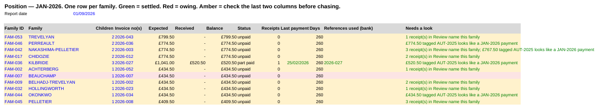

# Fee reconciliation

Reconciliation exists so that no family is chased for money they have paid, and no unpaid balance goes unnoticed until year end. The bank memo is the only link between a payment and an invoice, and most of the time that link is broken: parents mistype the reference, reuse last term's, run it together with their name, or send nothing but a surname. Families with several children pay one combined invoice, often in instalments, sometimes from an account in a different name. At a small roll one person can fix the exceptions by hand. As the school grows the exceptions become the bulk of the work, and a VLOOKUP needs a clean key, which the reference never is.

The result is that nobody can answer "who still owes us money?" without a day of manual work, so
it gets done once a term and part-payments go unnoticed until year end.

This repository builds a fee ledger from the roster and the bank export, then allocates each
receipt to a family on ranked evidence, allocating what it can prove and queuing the rest for a
human with the reasoning written out.

**On the sample data in `examples/`: 90% of receipts are allocated with no human involvement, and
none is allocated to the wrong family.** The remaining 8 go to a review queue. Across the three
seeds the harness runs, the figure is 89&ndash;91%, and no receipt is misallocated on any of them.



No real data appears anywhere in this repository. `generate_fake_data.py` is a fictional
roster and bank export that reproduce the failure patterns, which also means
every line has a known correct answer, so accuracy can be measured rather than asserted.

## How the school bills

Everything downstream follows from the fee rules, so they come first. The school is a Saturday
French school with a small Wednesday club, and its price list has four moving parts.

**Saturday tuition is charged per family, not per child.** The rate rises with the number of
siblings enrolled, but not proportionally, which is the sibling discount:

| Siblings enrolled | Per family, per session | Per child, per session |
|---|---|---|
| 1 | £19.50 | £19.50 |
| 2 | £34.50 | £17.25 |
| 3 | £46.00 | £15.33 |
| 4 | £57.10 | £14.28 |

**Wednesday club is charged per child**, flat, at £16.00 per session with no sibling tier.

**Two add-ons**, both £25: a one-off registration fee at first enrolment, and an annual supplies
charge.

**A term is a number of sessions.** JAN-2026 is 21 Saturday sessions and 20 Wednesday ones;
AUT-2025 was 11. So a single child on Saturdays for JAN-2026 owes 21 &times; £19.50 = **£409.50**,
and £434.50 with supplies, which is why those two amounts appear everywhere in the examples.

All of this lives on the `Rates` and `Terms` sheets of the generated workbook as data, not in code.
A price change is a cell edit.

Three properties of this billing model create the whole reconciliation problem:

- **Siblings share one invoice**, so a family pays one combined amount and the payment cannot be
  attributed to a child.
- **Invoice numbers are reissued each term** and, in the real data, were occasionally issued twice
  to unrelated families. So the invoice number cannot be the identity key.
- **Whoever holds the bank account pays**, and that is not always a parent whose surname matches
  the child's.

## Getting the data

There is no data in this repository to protect, so the first step generates some.

```bash
pip3 install -r requirements.txt
python3 generate_fake_data.py examples --seed 20260101
```

That writes three files:

| File | What it is |
|---|---|
| `roster.xlsx` | 60 families, ~94 children. Mirrors the real roster's column names and its quirks: surnames in capitals, invoice numbers with an `a` suffix on a sibling's row, free-text `PAID` notes. |
| `bank.xlsx` | 80 payment lines in the bank's own fixed-width memo format. |
| `ground_truth.csv` | The answer key: which family each of those 80 lines really belongs to. This is what makes accuracy measurable rather than asserted. |

The seed is deliberate. The same seed always produces the same roster, the same payments and the
same answers, so a change in the score is a change in the engine and never in the data. `check.sh`
runs three different seeds for the same reason.

The generator also plants specific problems on purpose, so that the checks have something to find:

- one child billed £18.00 for supplies instead of £25.00
- one child with a &minus;£30.00 supplies line, which the ledger reads as a discount
- one enrolled child with no invoice number and no fee
- two unrelated families issued the same invoice number, and receipts quoting it from both
- roughly 30% of families paying in two instalments rather than one
- one outgoing refund, to check that a negative amount is not treated as a receipt

## What makes the payments hard

The bank sends a fixed-width memo: 23 characters of payer name, then a 21-character reference slot
that silently truncates. The generator produces ten failure modes in the proportions below, taken
from the real ledger.

| Mode | Share of 80 | What the parent did |
|---|---|---|
| `clean` | 14 | Typed the reference exactly as invoiced |
| `prior_term` | 9 | Reused last term's reference |
| `name_only` | 9 | No reference, just a surname or "school fees" |
| `glued` | 6 | Ran the reference into their own name with no separator |
| `no_hyphen` | 5 | Dropped the hyphen, or added spaces |
| `truncated` | 5 | Wrote enough that the bank cut it off |
| `bare` | 4 | Typed only the three-digit part |
| `first_name_only` | 3 | Put a child's first name and nothing else |
| `wrong_ref` | 3 | Typed a valid reference belonging to a different family |
| `shared_invoice` | 2 | Used a number issued to two families |

Roughly 30% of these are then split into two instalments, and the second instalment usually carries
no reference at all, implying a 2nd payment or just the surname.

## Run the whole thing

```bash
python3 generate_fake_data.py examples --seed 20260101   # roster + bank + answer key
python3 build_ledger.py examples/roster.xlsx examples/bank.xlsx examples/fee_ledger.xlsx
python3 reconcile.py examples/fee_ledger.xlsx            # allocate; write Position / Review / Summary
python3 score.py                                         # accuracy against the answer key
./check.sh                                               # all of the above, gated
```

Step by step:

1. **`generate_fake_data.py`** invents the roster, the bank export and the answer key. Skip this
   entirely when running on real files.
2. **`build_ledger.py`** applies the fee rules to the roster to work out what each family owes,
   groups children into families, and loads the bank lines. Output is `fee_ledger.xlsx` with the
   `Rates`, `Terms`, `Families`, `Children` and `Receipts` sheets. It decides nothing about who
   paid what.
3. **`reconcile.py`** does the allocation, calling `engine.py` for every decision, and adds the
   `Position`, `Review` and `Summary` sheets to the same workbook.
4. **`score.py`** compares the result against the answer key and prints accuracy by failure mode.
   Only works on generated data since real data has no answer key.
5. **`check.sh`** runs the unit tests, then the whole pipeline on three seeds, then the score, and
   fails if a single receipt went to the wrong family.

To run it on real files, use `preflight.py` first. The file checks a roster and bank export against
what `build_ledger.py` requires and tells you what is missing, without changing anything.

```bash
python3 preflight.py your_roster.xlsx your_bank.xlsx
```

## What the bank actually sends

The memo is a fixed-width field with 23 characters of payer name, then a 21-character reference slot
that silently truncates. Every row below is real output from `examples/`, with the tier the engine
assigned and the reason it recorded.

| issue | bank memo | tier | reason |
|---|---|---|---|
| nothing | `BETTINA DELACROIX   2026-015` | A | invoice reference 2026-015 |
| glued to the name | `INGRID ERIKSEN      ERIKSE2026-017` | A | invoice reference 2026-017 |
| hyphen dropped | `VERA FALZON         2026018` | A | invoice reference 2026-018 |
| only the number | `ELODIE HASANOVIC    060` | B | surname HASANOVIC |
| cut off by the bank | `LUDOVIC ASHWORTH    ASHWORTH FRENCH SCHO` | B | surname ASHWORTH |
| no reference at all | `TOVE YANKOVIC       Yankovic` | B | surname YANKOVIC |
| a child's name only | `ZORA VANTERPOOL     Halima` | B | surname VANTERPOOL |
| second instalment | `GENEVIEVE MAALOUF   2nd payment` | A | payer name previously seen with a verified reference for this family |
| last term's reference | `KATRIN DUPLANTIER   2025-608` | B | surname DUPLANTIER (prior-term reference 2025-608 &mdash; family identified, invoice not loaded) |
| a number two families hold | `MARGIT PELLETIER    2026-008` | A | invoice reference 2026-008 |
| **someone else's reference** | `MARGIT RASMUSSEN    2026-039` | X | reference 2026-039 points to FAM-049 but the memo names FAM-048, parent may have typed the wrong invoice number |

Two rows are worth pausing on. `2026-008` is an invoice number two unrelated families were issued,
so the reference alone cannot decide; the surname in the memo picks between them and the line is
allocated. Take the surname away and the same reference goes to review instead. The reason string
records only the reference, which understates the evidence actually used, and is on the list to fix.

The last row is the case that matters. A naive matcher follows the reference, credits the wrong
family, one parent chased for money they paid and another incorrectly marked
as having been paid. The engine refuses to allocate when the reference and the payer name
disagree, and says so.

## How a receipt gets a family

Ranked evidence, first hit wins.

| tier | evidence | allocated? |
|---|---|---|
| M | a person typed a family ID into the override column | yes |
| A | current-term invoice reference naming exactly one family, uncontradicted by the memo, or a payer name already seen with a verified reference | yes |
| B | exactly one roster surname appears in the memo | yes |
| C | fuzzy evidence: a truncated or misspelt surname, or a child's first name | review |
| D | nothing usable, or several families fit | review |
| X | the reference and the payer name point to different families | review |

Two things do most of the work. **Aliasing**: confirm a payer once, by reference or by hand, and
every later payment from that account follows, including ones with no reference at all, which is
how second instalments get matched. **Refusing to guess**: tiers C, D and X are held back with
their candidates and reasoning, so a person spends their time on the 14% that need judgement.

Every reason string is a template, not a generated sentence. Each rule that fires appends a fixed
phrase. The same input always produces the same allocation and the same explanation, which is what
makes the output auditable.

## One family, end to end

Everything below is real output from `examples/`, seed 20260101.

The Maalouf family has two children on the roster. Siblings are billed on one invoice at the
two-child rate, so the family owes one combined amount rather than two separate ones.

| Child | Surname | First name | Class | Status | Invoiced |
|---|---|---|---|---|---|
| CH-064 | MAALOUF | Bastien | Saturday | Enrolled | £387.25 |
| CH-065 | MAALOUF | Kwame | Saturday | Enrolled | £387.25 |

Two payments arrive, five weeks apart, from the same account:

| Bank memo | Amount | Tier | Why the engine decided that |
|---|---|---|---|
| `GENEVIEVE MAALOUF   MAALOU2026-030` | £387.25 | A | invoice reference 2026-030 |
| `GENEVIEVE MAALOUF   2nd payment` | £387.25 | A | payer name previously seen with a verified reference for this family |

The second row is the one worth looking at. Its memo contains no invoice number, no term, and
nothing a lookup could key on, and a spreadsheet formula has nothing to work with. It is allocated
because the first payment tied the payer name GENEVIEVE MAALOUF to FAM-039 through a reference the
engine had already verified. Confirm a payer once and every later payment from that account
follows.

The family then appears on the Position sheet as settled:

| Family ID | Family | Children | Invoice no(s) | Expected | Received | Balance | Status | Receipts |
|---|---|---|---|---|---|---|---|---|
| FAM-039 | MAALOUF | 2 | 2026-030 | £774.50 | £774.50 | £0.00 | settled | 2 |

## What the Position sheet looks like

One row per family, and the sheet a bursar actually works from. Real output, three of each status:

| Family ID | Family | Children | Invoice no(s) | Expected | Received | Balance | Status | Receipts |
|---|---|---|---|---|---|---|---|---|
| FAM-001 | ABARCA | 1 | 2026-004 | £409.50 | £409.50 | £0.00 | settled | 1 |
| FAM-003 | ACHTERBERG-MARCHETTI | 1 | 2026-001 | £434.50 | £434.50 | £0.00 | settled | 1 |
| FAM-004 | ASHWORTH | 1 | 2026-005 | £434.50 | £434.50 | £0.00 | settled | 1 |
| FAM-021 | DUPLANTIER | 1 | 2026-016 | £409.50 | £204.75 | £204.75 | part paid | 1 |
| FAM-036 | KILBRIDE | 3 | 2026-027 | £1,041.00 | £520.50 | £520.50 | part paid | 1 |
| FAM-045 | PELLETIER | 1 | 2026-008 | £409.50 | £614.25 | &minus;£204.75 | **over paid** | 2 |
| FAM-002 | ACHTERBERG | 1 | 2026-052 | £434.50 | £0.00 | £434.50 | unpaid | 0 |
| FAM-007 | BEAUCHAMP | 1 | 2026-007 | £434.50 | £0.00 | £434.50 | unpaid | 0 |
| FAM-009 | BELHADJ-TREVELYAN | 1 | 2026-002 | £434.50 | £0.00 | £434.50 | unpaid | 0 |

Across the whole sample: **44 families settled, 5 part paid, 1 over paid, 10 still owing.**

FAM-045 is the interesting row. Nothing was misallocated to it: both of its receipts really are its
own, and the generator simply had that family pay twice. The point is that no matching rule could
have told anyone that. It surfaces because the sheet subtracts what came in from what the fee rules
say was owed, which is why the Position sheet carries a balance column and not just a paid flag.
The same column is what would catch a receipt landing on the wrong family, if one ever did.


## Measured on generated data

`python score.py`, seed 20260101:

```
failure mode        lines   auto  correct  WRONG  review
clean                  17     17       17      0       0
prior_term             14     14       14      0       0
name_only              11      9        9      0       2
glued                   9      9        9      0       0
no_hyphen               7      7        7      0       0
truncated               6      4        4      0       2
bare                    5      5        5      0       0
first_name_only         4      4        4      0       0
wrong_ref               4      1        1      0       3
shared_invoice          2      2        2      0       0
outflow                 1      0        0      0       1
TOTAL                  80     72       72      0       8

allocated automatically : 72/80 = 90%
of those, correct       : 72/72 = 100.0%
sent for human review   : 8
```

The design target is precision, not coverage. Sending more lines to a human is a cost; crediting
one to the wrong family is a wrong answer that propagates into arrears letters. `pytest` asserts
zero misallocations across three independently generated datasets.

`score.py` also runs the simplest thing that could work, allocate when exactly one roster
surname appears in the memo, 
and prints it alongside:

```
                            allocated    correct
naive surname-only          66/80        100.0%
engine                      72/80        100.0%
the ladder is worth         +6 receipt(s)
```

On the other two seeds the ladder is worth +11 and +5.

That margin is still modest, and part of it is a fact about the fixture rather than the engine. The
generator builds every payer name as `{parent first name} {family surname}`, so the correct answer
is written in plain text on nearly every fee line and a surname lookup cannot help but find it. The
tiers earn the rest: a reference the surname alone cannot resolve, a second instalment with no
reference at all, and an invoice number two families hold. Where they would earn far more is when
the payer is *not* the family, such as a grandparent, a company account, or a parent with a
different surname, and the generator never produces one. On the school's real bank export, 23 of
the allocated receipts were paid by someone whose name does not carry the family's surname, so this
gap is the single most useful change left, and it is why the baseline is printed rather than
hidden.

### What the sample data does not cover

Being explicit about this, because the numbers above are only as good as the fixture behind them:

- **No Wednesday club children.** The fee model prices them at £16.00 per child per session with no
  sibling tier, and `build_ledger.py` implements it, but the generator produces none, so that whole
  branch is priced and never exercised.
- **Every payer surname matches the family**, as above.
- **No third-party payers**, no company accounts, no grandparents.
- **Payment amounts sit exactly on the model**, full amount or exact half. Real transfers are
  rounded, combined across terms, or short by a few pounds.
- **One term only.** AUT-2025 exists in `Terms` but its invoice register is not loaded, so
  prior-term receipts can be identified by family and not reconciled against an invoice. On the
  real data this is more than a detail: 132 of 248 receipts are autumn-term, and they stay
  unreconciled until the office supplies that term's invoice numbers.
- **A family can be sampled twice**, which is why one family shows as over paid above. Real double
  payments happen, but here it is an accident of the generator rather than a case it sets out to
  produce.

## The ledger

`build_ledger.py` writes a workbook rather than a database, because the people who use it live in
spreadsheets and need to see what happened.

- **Position**: one row per family: expected, received, balance, status, every bank reference they
  used, and a plain-English flag such as *£520.50 tagged AUT-2025 looks like a JAN-2026 payment*.
  Green settled, red owing, amber check before chasing.
- **Review**: the only sheet needing a human. Decide, type the family ID into `Receipts` column F,
  re-run `reconcile.py`.
- **Receipts**: every bank line and what the engine did with it.
- **Children / Families**: the roster, with each child's fee computed from the rules and compared
  against what was actually invoiced, so mis-invoiced pupils surface automatically.
- **Rates / Terms**: the fee rules as data. A price change is a cell edit; nothing is hard-coded.

Two structural decisions worth explaining, because they came out of the real data:

**The invoice number cannot be the family key.** Unrelated families were issued the same number,
and numbers change every term, so history would be lost. Families get a stable `FAM-nnn` key and
invoice numbers hang off it.

**Fee rules are data, not code.** Sibling tiers, session counts, registration and supplies charges
live in `Rates` and `Terms`. Running the rules against the invoices as a check found a pupil billed
£18 for supplies instead of £25, an error nobody had spotted.

## Future work

- First name matching only works while a first name is unique on the roster; a second child with
  the same name drops it to tier D.
- Aliasing assumes one bank account belongs to one family. It held on the data tested, but a
  grandparent paying for two families would break it. 
- Ageing runs from the term start, not from invoice date, because invoice dates were not available.
- A term whose invoice register has not been loaded can have its receipts identified by family but
  not reconciled against an invoice, those are flagged.
- Amounts are not used as matching evidence, but only as a sanity check for later review

## Files

```
engine.py               allocation logic: pure functions, writes no Excel, unit-testable in milliseconds
reconcile.py            loads the ledger, calls the engine, writes Position / Review / Summary
build_ledger.py         roster + bank  ->  structured workbook
generate_fake_data.py   fictional roster + bank export + ground truth
score.py                accuracy against ground truth, by failure mode, against a naive baseline
preflight.py            checks a real roster and bank export before you run the pipeline
check.sh                the harness: unit tests, end-to-end on three seeds, WRONG must be 0
tests/test_engine.py    21 unit tests on the matching rules (no workbook needed)
tests/test_pipeline.py  end-to-end tests over 3 generated datasets
examples/               generated data and the resulting ledger
```

## How changes are made

`check.sh` is the gate: it runs the unit tests, then the whole pipeline end to end on three
generated seeds, then the score, and it fails unless `WRONG` is 0. Claude Code was used both to
write changes and to review them, as two agents (separate sessions with their own instructions)
defined in `.claude/agents/`. The first session makes one change in `engine.py` and adds a unit test
that fails without it. The second session sees only the diff and the gate output, never the first
session's reasoning, and its job is to construct an input that credits a receipt to the wrong
family. If it finds one, the change goes back to the first session, and no change is committed until
the gate is green. The gate matters more than the agents: a change that lifts coverage by allocating
receipts wrongly cannot pass it, whoever wrote it. The setup is described in
[docs/AGENT_WORKFLOW.md](docs/AGENT_WORKFLOW.md).

MIT licensed.
